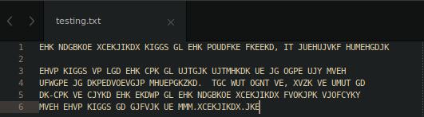
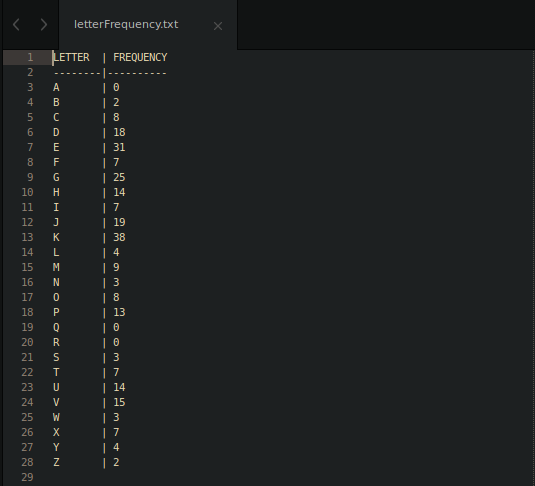

# Monoalphabetic Cipher Decryption Project
> Benzon Carlitos Salazar

## Overview
In this project, you are tasked with performing a cryptanalytic Ciphertext-Only Attack (COA) on the provided text document.  You are given the intercepted ciphertext as a text file and know that the message was encrypted using a Monoalphabetic cipher.

Your task is to write a program which can...

- [x] Assist you in retrieving the key used to encrypt the original message
- [x] Use the key to decipher the original message as plaintext

## Requirements
1. The program obtains the frequency of each letter in the ciphertext (**non-letter symbols can be ignored**).
2. Provide your [analysis](/src/analysis/Analysis.txt) on the key you obtained using cryptanalysis.  Include this as a document with your submission (**PDF preferred**).  You must primarily use [frequency analysis](/src/out/LetterFrequency.csv) (minimum single-letter frequency) and assist it with analysis on the ciphertext using your knowledge of the English language or other preexisting knowledge.  Describe in detail how you improved your key until you obtained the final correct key and corresponding plaintext.  The expected length is around 2-3 pages double-spaced (**no maximum**).
3. Your [program](/src/Monoalphabetic.java) [decrypts](/src/out/plainText.txt) the ciphertext into plaintext using the key you obtained (**Note that non-letter symbols are already plaintext, no need to decrypt them**).
4. Include the original plaintext as a [.txt](/src/BenzonS.txt) file
5. Code must compile and run to receive a grade
6. You *must* use the [text file](/src/BenzonS.txt) with your name on it

## Example
### [Input Text](./src/tests/testing.txt):

### [Letter Frequency](./src/tests/letterFrequency.txt):

### [Plaintext result](./src/tests/plainText.txt):

